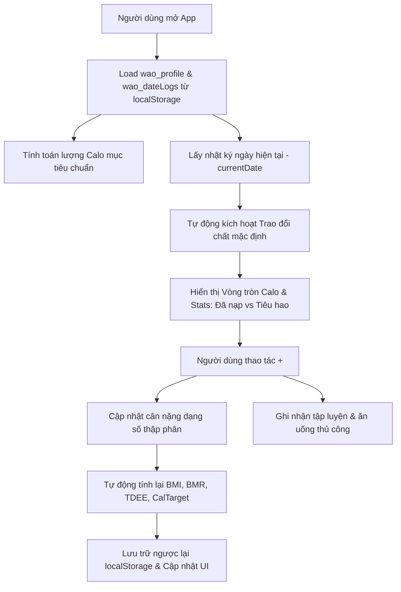

# TÀI LIỆU VẬN HÀNH & PHÁT TRIỂN ỨNG DỤNG "LÂMBE CALORIE"

Tài liệu này tổng hợp toàn bộ quy trình, kiến trúc, cách thức hoạt động và sơ đồ logic của ứng dụng **LâmBe Calorie** để hỗ trợ lập trình viên (hoặc AI agent) ở phiên làm việc tiếp theo có thể nhanh chóng nắm bắt và tiếp tục phát triển.

---

## I. TỔNG QUAN DỰ ÁN & CÔNG NGHỆ
* **Stack chính:** React (v18+) + Vite + Vanilla CSS (định hình giao diện theo chuẩn iOS).
* **Đặc trưng thiết kế:** Premium dark mode, bo tròn chuẩn Apple, hiệu ứng mờ kính (Glassmorphism), tối ưu hóa hiển thị dọc dạng ứng dụng di động (Mobile web container).
* **Quản lý dữ liệu:** Lưu trữ trực tiếp dưới dạng JSON trong trình duyệt qua `localStorage`. Không cần database server bên ngoài.
  - `wao_profile`: Lưu thông tin cá nhân cơ bản (chiều cao, cân nặng hiện tại, mục tiêu cân nặng, tuổi, giới tính, mức vận động, calo mục tiêu).
  - `wao_dateLogs`: Lưu lịch sử ăn uống, nước uống, cân nặng, hoạt động tập luyện theo ngày dạng YYYY-MM-DD.

---

## II. SƠ ĐỒ HOẠT ĐỘNG CỦA HỆ THỐNG (Architecture Flow)

---

## III. CHI TIẾT CÁC TÍNH NĂNG CHÍNH

### 1. Cơ chế tính toán Thể chất & Calo mục tiêu
Công thức được tính tự động khi khởi tạo hoặc khi cập nhật cân nặng qua hàm `recalculateProfileWithWeight(newWeight)`:
* **BMI:** $Weight / (Height/100)^2$
* **BMR (Mifflin-St Jeor):**
  - Nam: $10 \times Weight + 6.25 \times Height - 5 \times Age + 5$
  - Nữ: $10 \times Weight + 6.25 \times Height - 5 \times Age - 161$
* **TDEE (Tổng tiêu thụ năng lượng hàng ngày):** BMR $\times$ Hệ số vận động (1.2 đến 1.9).
* **CalTarget (Calo mục tiêu mỗi ngày):**
  - Giảm cân: TDEE - 500 kcal (Giới hạn tối thiểu: Nam 1400 kcal, Nữ 1200 kcal).
  - Tăng cân: TDEE + 400 kcal.
  - Giữ cân: TDEE.

### 2. Tự động tiêm Hoạt động chuyển hóa cơ bản (Metabolic Log Injection)
Mỗi khi người dùng truy cập nhật ký của một ngày, ứng dụng tự động kiểm tra và tiêm hoạt động tiêu thụ mặc định:
* **Hàm thực thi:** `getActiveDayLog()` kết hợp `getDefaultExercises()`.
* **Cơ chế hoạt động:** 
  - Tạo ra 1 hoạt động mặc định có ID `default-bmr` tên là: **"Chuyển hóa cơ bản (Trao đổi chất)"** với năng lượng tiêu hao chính xác bằng chỉ số BMR hiện tại của người dùng.
  - Khi lưu trữ hay lấy dữ liệu, hệ thống tự động lọc bỏ các hoạt động mặc định cũ và áp dụng hoạt động mặc định mới nhất theo cân nặng hiện thời của ngày hôm đó để tránh tính trùng lặp.
* **Calo còn lại (CalRemaining):** Tính theo công thức:
  $$\text{CalRemaining} = \text{CalTarget} - \text{Calo đã nạp} + \text{Calo tập luyện thêm (không tính Chuyển hóa mặc định)}$$

### 3. Click Xem chi tiết (Modal Sheets)
* **Đã nạp (Consumed):** Khi click vào cột "Đã nạp" trên màn hình chính, bottom sheet sẽ hiển thị danh sách các món ăn đã ghi nhận trong ngày (chia theo Bữa sáng, Trưa, Tối, Phụ), cho phép người dùng xem đạm/carb/béo và xóa món ăn trực tiếp.
* **Tập luyện (Exercise):** Khi click vào cột "Tập luyện", bottom sheet hiển thị danh sách các hoạt động tiêu hao năng lượng trong ngày (gồm mục mặc định "Chuyển hóa cơ bản (Trao đổi chất)" và các hoạt động tập luyện thêm như cầu lông, gym, cardio).

### 4. Hệ thống báo cáo theo tuần cố định (Monthly-based Weeks)
Bộ chọn tuần trong Báo cáo hoạt động theo lịch cố định của tháng hiện tại thay vì tuần tương đối:
* **Hàm phân chia:** `getMonthWeeks(dateStr)` chia tháng của ngày đang chọn thành 4 tuần:
  - **Tuần 1:** Từ ngày 01 đến ngày 07.
  - **Tuần 2:** Từ ngày 08 đến ngày 14.
  - **Tuần 3:** Từ ngày 15 đến ngày 21.
  - **Tuần 4:** Từ ngày 22 đến ngày cuối cùng của tháng (28, 29, 30 hoặc 31).
* **Mặc định Active:** Kích hoạt tuần hiện tại tự động thông qua hàm `getActiveWeekIndex(dateStr)`. (Ví dụ: ngày 27/07 thuộc phạm vi ngày $\ge 22$ nên sẽ tự động chọn và làm nổi bật **Tuần 4** ở cuối danh sách).
* **Hiển thị biểu đồ:** Vẽ cột Calo tiêu thụ của từng ngày trong tuần được chọn kèm đường nét đứt biểu thị Calo mục tiêu (Target).

---

## IV. CÁC ĐẦU VIỆC CẦN LƯU Ý KHI TIẾP TỤC PHÁT TRIỂN
1. **Kiểm thử giao diện:** Khi chuyển sang máy mới, hãy khởi chạy dự án bằng lệnh `npm run dev` để kiểm tra độ mượt mà của các modal sheet trên thiết bị di động (giả lập iOS).
2. **Khôi phục dữ liệu:** Để test nhanh các tuần báo cáo khác nhau, lập trình viên có thể thay đổi ngày hệ thống `currentDate` hoặc tiêm tay dữ liệu giả lập vào biến `dateLogs` trong `localStorage`.
3. **Mở rộng tính năng:** Nếu muốn phát triển tiếp phần ghi nhận ăn uống, các bữa ăn hiện được lưu trữ trong `currentLog.meals` (gồm 4 mảng con `breakfast`, `lunch`, `dinner`, `snack`). 
